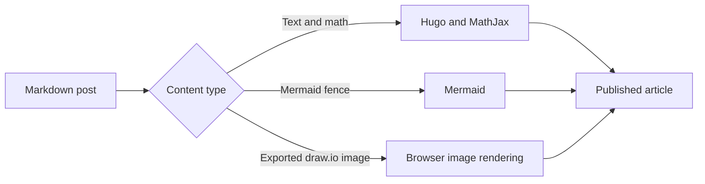

+++
title = "Theme feature showcase"
description = "A reference post demonstrating the Markdown, code diff, navigation, annotation, math, and diagram features supported by the theme."
date = 2026-08-18
draft = true
tags = ["hugo", "theme", "reference"]
math = true
+++

This draft is a compact authoring reference for the theme. It includes enough headings to populate
the table of contents, and its tags link back to Hugo's taxonomy pages. Margin notes sit
beside their reference on wide screens and move inline on smaller screens. They support
**Markdown**, links, and `inline code`.

## Prose and structure

Regular paragraphs can contain **strong text**, _emphasis_, [links](https://gohugo.io/), and
`inline code`. A block quote is visually separated from the surrounding prose:

> Good technical writing makes the important path easy to follow and keeps supporting detail close
> to the point where it matters.

Lists work as expected:

1. Add front matter.
2. Write the article in Markdown.
3. Preview it with `hugo server -D`.

- Use headings to generate the table of contents.
- Add tags to make the article discoverable.
- Keep images and diagrams in `static/`.

### Tables and code

Tables remain within the reading column:

| Feature     | Authoring syntax        | Rendering            |
| :---------- | :---------------------- | :------------------- |
| Margin note | `note` shortcode        | Right rail or inline |
| Math        | TeX delimiters          | MathJax              |
| Mermaid     | Fenced code block       | Responsive SVG       |
| draw.io     | Markdown image          | Exported SVG or PNG  |
| Code diff   | Fenced block attributes | Language-aware diff  |

Fenced code blocks support Hugo syntax highlighting, optional titles, and horizontal scrolling for
long lines. A title does not enable diff styling:

```go {title="Code"}
package main

import "fmt"

func main() {
    features := []string{"math", "mermaid", "margin notes"}
    fmt.Printf("Theme features: %v\n", features)
}
```

### Syntax-highlighted code diffs

A diff keeps the code language in the fence and adds `diff=true`. Lines beginning with `+` are
additions, lines beginning with `-` are removals, and lines beginning with a space provide context.
The optional `title` labels the example:

```go {diff=true title="Extend the feature list"}
 func main() {
-    features := []string{"math", "mermaid", "margin notes"}
+    features := []string{"math", "mermaid", "margin notes", "code diffs"}
     fmt.Printf("Theme features: %v\n", features)
 }
```

Hugo still applies Go syntax highlighting because the fence remains a `go` block. The diff markers,
full-line backgrounds, and text labels distinguish additions from removals without relying on color
alone. The theme implements the view with Hugo's built-in Chroma highlighter and local CSS, so it
does not load a highlighting or diff library from a content delivery network (CDN).

## Mathematics

Inline TeX fits into a sentence, such as the mass-energy relation $E = mc^2$.

Display equations receive their own line. For an orbit with gravitational parameter $\mu$, radius
$r$, and semi-major axis $a$, the vis-viva equation is

$$
v^2 = \mu\left(\frac{2}{r} - \frac{1}{a}\right).
$$

Math can be enabled for the whole site with `params.math`, or for one post with `math = true` in its
front matter.

## Mermaid diagrams

A fenced block with the `mermaid` language is rendered as a diagram:



Without JavaScript, the Mermaid source remains readable as a code block.

## Exported draw.io diagrams

Export a diagram from draw.io as SVG or PNG, put it below `static/`, and reference it exactly like a
picture:


The browser loads the exported file directly; the site does not connect to the online draw.io
viewer.

## Footnotes and separators

Footnotes are available through normal Markdown syntax.[^reference]

---

The horizontal rule above can separate a conclusion or appendix from the main article.

[^reference]: Footnotes are collected by Hugo and linked back to their references in the prose.
