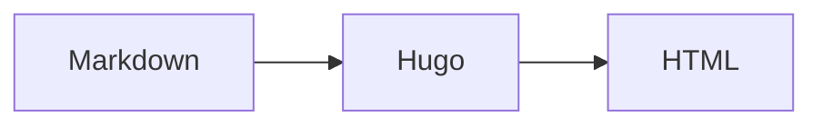

# Margin Tech

A restrained Hugo theme for technical writing.

## Features

- Home page with author bio and posts grouped by year
- Vertically stacked home-page bio and archive
- Hugo tag taxonomy and tag index
- About / normal content pages
- Three-column desktop post layout: sticky TOC, article, margin notes
- Non-sticky, marker-free margin notes aligned with their references and inline on small screens
- Active TOC section highlighting
- Syntax-highlight friendly code blocks
- MathJax equations and Mermaid fenced code blocks
- Standard Markdown images for exported draw.io diagrams
- Configurable social links in the site header
- Automatic dark mode plus a persisted manual light/dark switch
- Soft One Dark Pro-inspired dark palette and restrained light palette
- Theme-aware Chroma syntax highlighting without inline Monokai styles
- Self-hosted Source Sans 3 headings, Source Serif 4 prose, and Fira Code code typography

## Install

Place the theme at `themes/hugo-margin-tech`, then set:

```toml
theme = 'hugo-margin-tech'
```

Copy/adapt the configuration from `hugo.toml` or `exampleSite/hugo.toml`.

## Margin notes

Use notes inline in Markdown:

```md
A sentence worth annotating. This appears in the right margin on wide screens.
```

On narrower layouts, clicking the numbered marker reveals the note inline.

## Content

Posts live under `content/posts/` and should have `date`, `description`, and optional `tags` front matter.

## Identity and social links

Set the author name with `params.name`; the bio and footer copyright use this value. The header shows
configured `github`, `linkedin`, `mastodon`, `bluesky`, and `email` values. GitHub and Bluesky may be
handles or complete URLs; Mastodon should be a complete profile URL.

## Math and diagrams

Enable MathJax site-wide with `params.math = true`, or only on selected pages with `math = true` in
front matter. Inline math uses `$...$`, and display math uses `$$...$$`.

Mermaid works directly in a fenced Markdown block:

````md

````

Export draw.io diagrams to SVG or PNG, place them under the site's `static/` directory, and include
them as normal Markdown images:

```md

```

This approach does not require the online draw.io viewer.

## Typography

The theme self-hosts variable WOFF2 fonts and uses `font-display: swap` with system fallbacks:

- Source Sans 3 for headings, navigation, and interface text;
- Source Serif 4 for article prose, including a real italic face;
- Fira Code for code blocks, inline code, dates, and other monospaced metadata.

The redistributed font licenses are stored in `static/fonts/licenses/`.
